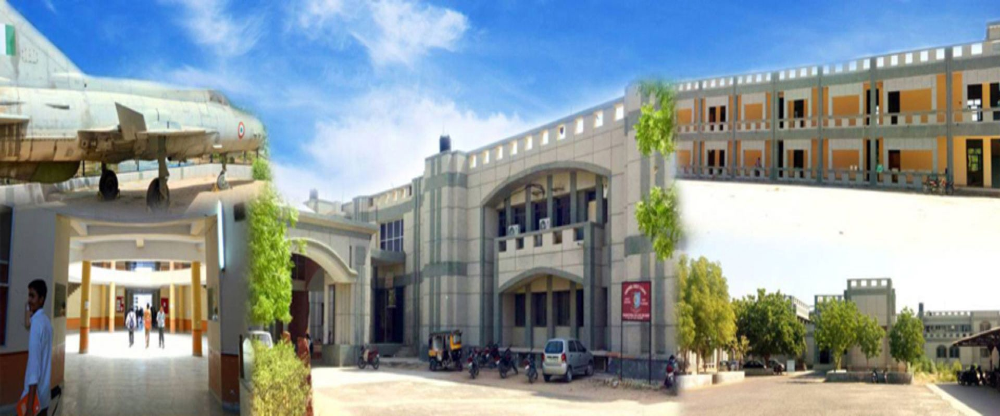

# CS-CLUB
# Computer Science is a broad field that continues to widen. Opportunities abound for students to turn their interest in computer technology into new innovations and challenging and rewarding careers. The breadth of the field, however, and the need to learn at least a smidge about each little corner while building demonstrable expertise in at least one of them, proves a daunting challenge. With four years to accomplish this, students sometimes feel flooded with too much to learn in too little time. They may also lose sight of the ultimate goal, which is to nurture their interest in computing and channel it into a force for innovative thinking and effective problem solving. Add to this burden the need – rightly articulated by professors, interviewers, and guest speakers from industry – that students develop well-honed soft skills so they may communicate effectively with co-workers and customers. Pulled in so many directions, some students may wonder just what they got themselves into in the first place.

# The Department of Computer Science & Engineering was established in the year 1999. Department of Computer Science & Engineering at the Engineering College Bikaner has been at the forefront of churning out software engineers with a high caliber of technical expertise. It continues to foster and engender the innovation and breadth of vision necessary to excel in the blooming software industry. The department has always attracted the best of engineering aspirants from all over. The department has a well qualified and experienced faculty members. The Department offers B. Tech., M. Tech. And Ph.D. courses.
